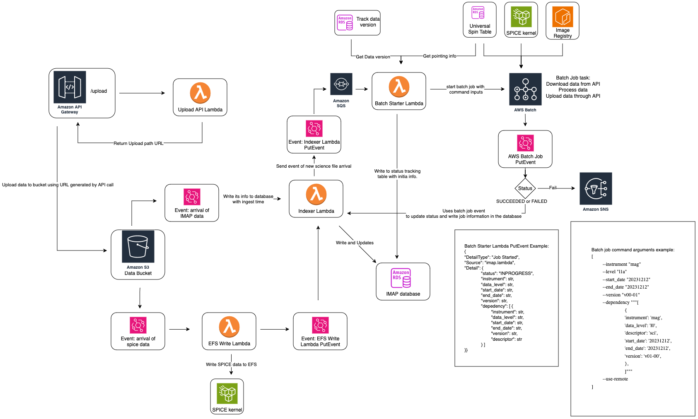

Data Dependency Management
==========================

The IMAP Science Data Center (SDC) utilizes an event-based processing system that allows for
processing as soon as data is available. This system is designed to be flexible to
accommodate the various requirements and inter-dependencies for all 10 instruments.

As part of our requirements, we need some way to explicitly describe the dependencies
for each file. We also need to be able to flexibly update the dependencies on a regular
basis, to accommodate changing requirements.

Overview
--------

When a file lands in the SDC, it is added to our data bucket (Also called S3 or S3 bucket.) This bucket, as the name implies, is a simple collection which contains all the files in the SDC, organized
like a file system.

Each data file is put into a specific subfolder depending on the file name. For example, a file named ``imap_swe_l0_sci_20240105_20240105_v00-01.pkts`` would be placed in the ``imap/swe/l0/2024/01`` folder.
More information about the naming conventions can be found in :ref:`naming-conventions`.

When a file of any level arrives in the bucket, it triggers the rest of processing. This is how we manage file processing within the SDC, rather than waiting until all files have arrived
or running at particular times of day. This allows us to quickly process data as soon as all the required pieces are available to us, and create a flexible system which can easily be updated
to add exceptions or new requirements on a per-instrument or per-level basis.

.. note::
    This document, and our tooling, uses the terms "upstream dependencies" and "downstream dependencies" to describe the relationships between files. A "downstream dependency" for a given file
    means that the current file is required for processing of the downstream files - so, for example, an L2 file is a downstream dependency of an L1 file. An "upstream dependency" is the opposite,
    describing a file which is required to begin processing the current file. For example, an L1 file is an upstream dependency of an L2 file.

Detailed Description of File Processing
---------------------------------------

For explicit descriptions of the tools and technical choices of the IMAP SDC, please refer to `this Galaxy page <https://lasp.colorado.edu/galaxy/display/IMAP/SDC+Architecture>`_.
This section is intended to act as a high level overview for the data processing architecture of the IMAP SDC, in less technical terms.

`Up to date overview chart in Galaxy <https://lasp.colorado.edu/galaxy/display/IMAP/SDC+Processing+Architecture+Overview>`_

Each science file that arrives is treated the same, regardless of level or instrument. When a file is placed in the file storage system, it triggers a step to index the file ("indexer lambda").
This step adds the file to the database and triggers the next step in processing ("batch starter lambda").

This step is what determines if a instrument and level is ready for processing, by checking dependencies. For each file that arrives, the system checks to see what the downstream dependencies are -
meaning, what future files need this file in order to complete processing. For example, if a MAG L1A file arrived, this step would determine that the MAG L1B ``mago`` and ``magi`` files are dependent on
the L1A file, and therefore MAG L1B may be ready to begin processing.

Then, for each anticipated job, the batch starter process checks to see if all the upstream dependencies are met. Although we know we have one of the upstream dependencies for an expected job,
it's possible that there are other required dependencies that have not yet arrived. If we are missing required dependencies, then the system stops processing and waits for the missing files to arrive.
Once missing file has arrived, it will trigger the same process, but all the required dependencies will be ready, and therefore processing can continue.

For example, SWAPI L3 requires both SWAPI L2 files and MAG L1D (previously called L2pre) files. The SWAPI L2 job and the MAG L1D job are run independently, so there is no guarantee that they will finish
at the same time. Let's assume that the MAG L1D job finishes first, since it is the lower level. When that file arrives, one of the downstream dependencies is going to be the SWAPI L3 processing.
However, when batch starter checks the upstream dependencies for SWAPI L3, it will find that SWAPI L2 is missing. Therefore, processing won't start. Once the SWAPI L2 processing finishes,
and the SWAPI L2 file arrives, the batch starter is triggered with that file. Once again, SWAPI L3 is a downstream dependency, but this time, both upstream dependencies for SWAPI L2 are present.
Therefore, processing for SWAPI L3 can begin.

The status of different files is recorded in the status tracking table. This table records the status of each anticipated output file as "in progress", "complete", or "failed." Through this,
we can track processing for specific files and determine if a file exists quickly.

Data Dependency Database Table
------------------------------

How does the SDC track which files are dependent on others? In order to decide what the downstream or upstream dependencies of a file are, and what the nature of those dependencies are, we
need some way to request the upstream or downstream dependencies of a given file. The current dependencies between instruments are recorded in `Galaxy <https://lasp.colorado.edu/galaxy/display/IMAP/Dependency+Between+Instrument+-+Diagram>`_.

We handle this using a SQL database. All of our databases are described in detail `here <https://lasp.colorado.edu/galaxy/display/IMAP/SDC+Database+Tables>`_.

The database has the following structure:

========== ===== ========== ===================== ================ ===================== ======================== ======================
instrument level descriptor dependency_instrument dependency_level dependency_descriptor relationship_description DOWNSTREAM or UPSTREAM
========== ===== ========== ===================== ================ ===================== ======================== ======================
mag        l1a   norm-mago  mag                   l0               raw                   HARD                     UPSTREAM
mag        l1a   norm-mago  mag                   l1b              norm-mago             HARD                     DOWNSTREAM
mag        l1a   norm-magi  mag                   l1b              norm-magi             HARD                     DOWNSTREAM
mag        l1d   norm       swapi                 l3               sci                   HARD                     DOWNSTREAM
swapi      l2    sci        swapi                 l3               sci                   HARD                     DOWNSTREAM

========== ===== ========== ===================== ================ ===================== ======================== ======================

Dependency Types
----------------

Right now, we only have HARD dependencies. This means that upstream processing is blocked on the existence of dependent files. However, we have also have requirements for SOFT dependencies - where
processing should use the file if it exists, but can continue without it. This is a future feature. The relationship description column exists so we can define specific relationships between
files.

This can also include information on reprocessing rules.

