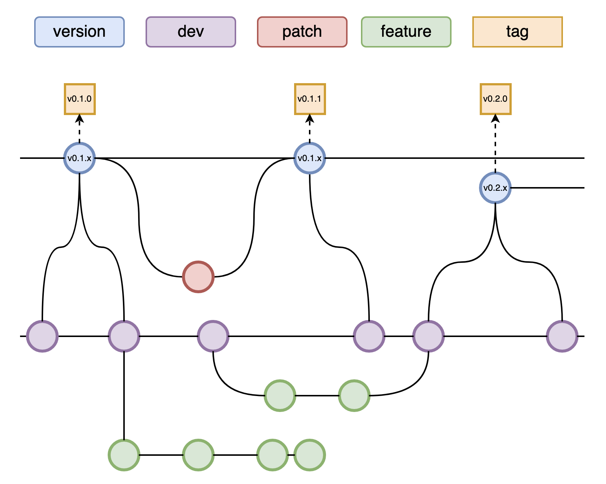

.. _git-and-github-workflow:

git and GitHub Workflow
-----------------------

The best method for contributing software to the repository is a workflow that involves forking the repository,
developing changes on "feature" branches, and opening pull requests through GitHub.

The following diagram depicts this workflow:

As such, all feature branches should be branched off of and merged back into the ``dev`` branch.

.. _contributing-new-features:

Contributing new features
^^^^^^^^^^^^^^^^^^^^^^^^^

Before contributing, it is generally encouraged to open a GitHub issue (`imap_processing
<https://github.com/IMAP-Science-Operations-Center/imap_processing/issues/new/choose>`_, or `sds-data-manager
<https://github.com/IMAP-Science-Operations-Center/sds-data-manager/issues/new/choose>`_), if one does not already
exist, that describes the feature to be implemented, or the problem that is trying to be solved. This allows the
contributor and the team as a whole to keep track of how the feature relates to the project and track its progress. Any
contributors to the feature should be assigned to the issue, and proper label(s) should also be assigned.

*Note: We use the 'imap_processing' repository as an example here, but this can be applied to 'sds-data-manager' as
well.*

*Note: Steps (1) through (5) only to be completed once.*

#. Create a personal fork of the ``imap_processing`` repository by visiting the main ``IMAP-Science-Operations-Center``
   ``imap_processing`` `repository <https://github.com/IMAP-Science-Operations-Center/imap_processing>`_ and clicking
   the ``Fork`` button near the top-right of the page. Follow the various steps to create a fork under your GitHub
   account.

   *Note: Hold the naming convention username/imap_processing. The branch title will follow the specific project.*

#. Make a local copy of your personal fork by cloning the repository, using the URL found by clicking the green "clone"
   button:

   .. code-block:: bash

       git clone https://github.com/<username>/imap_processing.git  # for HTTPS
       git clone git@github.com:<username>/imap_processing.git  # for SSH

   This must be done even if you have previously cloned the repository. You must clone your personal fork.

#. Ensure that the personal fork is pointing to the ``upstream`` ``imap_processing`` repository:

   .. code-block:: bash

       git remote add upstream https://github.com/IMAP-Science-Operations-Center/imap_processing.git  # for HTTPS
       git remote add upstream git@github.com:IMAP-Science-Operations-Center/imap_processing.git  # for SSH

#. Install the ``pre-commit`` library to enable pre-commit hooks. These hooks will automatically run the
   `ruff <https://beta.ruff.rs/docs/>`_ formatter and linter on your code changes
   before commits:

   .. code-block:: bash

       pip3 install pre-commit

   If this results in errors, check the correct form of pip is being employed using ``which pip`` or ``which pip3``.

   Then, while in the top directory of the repository, run:

    .. code-block:: bash

        pre-commit install

   *Note: This is optional, but helpful. This goes through pre-commit hooks locally for convenience which will also run when a pull request is made on GitHub.*

#. Create a feature branch off of the ``dev`` branch to develop changes on. Branch names should be short but
   descriptive (e.g. ``update-codice-unit-tests``) and not too generic (e.g. ``bug-fix``, ``updates``). Consistent use
   of hyphens is encouraged.

   In the terminal, set your working directory to the file path of the fork you created in step one. Then, run the following command:

   .. code-block:: bash

        git checkout -b <branchname>

#. Make changes to the branch using the nominal ``git add``/``git commit`` cycle.

   *Note: You can open the forked repository in a chosen IDE to make changes.*

   .. code-block:: bash

        git add <new or changed files you want to commit>
        git commit -m 'Explanation of the changes'

   With the pre-commit hooks installed, you may need to make fixes to any warnings/errors reported by
   ``ruff`` and try committing your changes again.

#. Push the feature branch to your personal fork's GitHub repository:

   .. code-block:: bash

        git push origin <branchname>

#. On the ``IMAP-Science-Operations-Center`` ``imap_processing`` `repository
   <https://github.com/IMAP-Science-Operations-Center/imap_processing>`_ create a new pull request. Click on the
   "compare across forks" link to enable the pull request to use your fork. Set the "base repository" to
   ``IMAP-Science-Operations-Center`` and "base" to ``dev``. Set the "head repository" to the ``imap_processing``
   repository under your personal fork and "compare" to your feature branch. If the feature branch is still under
   development, you can click the "Convert to draft" button under the "Reviewers" section, or add a "[WIP]" at the
   beginning of the pull request title to signify that the pull request is not ready to be merged.

#. Assign at least one reviewer to the pull request, though two or more reviewers are highly encouraged, especially for
    significant changes. They will review your pull request and either accept the request or ask for additional changes.
    If additional changes are needed, iterate through steps (7) and (8) until you and the reviewer(s) are satisfied.

#. Once the pull request has been accepted, you can merge the pull request and delete the feature branch.

.. _keeping-your-fork-updated:

Keeping your fork updated
^^^^^^^^^^^^^^^^^^^^^^^^^

You can keep your personal fork up-to-date with the ``IMAP-Science-Operations-Center`` ``imap_processing`` repository by
either fetching and rebasing with the ``upstream`` remote, or fetching and pulling with the ``upstream`` remote:

.. code-block:: bash

    git checkout dev
    git fetch upstream
    git rebase -i upstream/dev

or

.. code-block:: bash

    git fetch upstream dev
    git pull upstream/dev

.. _collaborating-on-someone-elses-fork:

Collaborating on someone else's fork
^^^^^^^^^^^^^^^^^^^^^^^^^^^^^^^^^^^^

To contribute to a branch on another person's personal fork, add a new ``remote`` that points to their fork, and use the
nominal workflow for contributing:

.. code-block:: bash

    git remote add <username> <remote url>
    git fetch <username>
    git checkout -b <branchname> <username>/<branchname>
    # Make some changes via add/commit cycle
    git push <username> <branchname>
