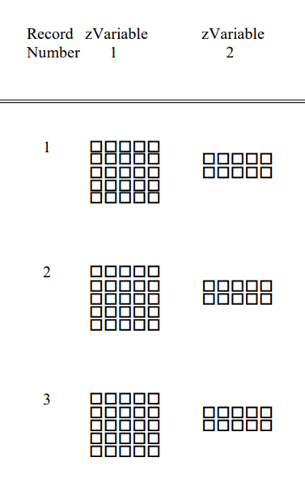

################
CDF Introduction
################

The Common Data Format, or CDF files, are binary files which require custom libraries to create and manipulate. Goddard Space Flight Center (GSFC) maintains these CDF libraries, and is the shepherd of the file format.

The GSFC describes CDF files as a "self-describing data format for the storage of scalar and multidimensional data in a platform- and discipline-independent way".

IMAP is archiving its science data with the `Space Physics Data Facility (SPDF) <https://spdf.gsfc.nasa.gov/>`_, which requires that data be in the CDF file format.

CDF Ecosystem
=============
**CDF** refers to more than just the files themselves, but the entire toolkit surrounding those files.  The official toolkits are available in IDL, C, Fortran and MATLAB.

For python implementations, there is `cdflib <https://github.com/MAVENSDC/cdflib>`_, which is a pure-python implementation of the CDF specification. **cdflib** contains the functions "xarray_to_cdf" and "cdf_to_xarray" to convert between xarray Dataset objects in python and the CDF file formats.

.. note::
   The L0->L2 processing will be using cdflib to generate CDF files on IMAP.  For more information about cdflib and the xarray_to_cdf function, see :ref:`cdflib.xarray_to_cdf`

The other main python library is `pycdf <https://spacepy.github.io/pycdf.html>`_, which is a part of **spacepy**.  Pycdf wraps the C libraries, and therefore it requires downloading the C libraries.  Because it is a part of Spacepy, Pycdf requires downloading and installing Spacepy.  Pycdf includes various bells and whistles that help make the files more python friendly, and includes functions for checking for ISTP compliance.

What's in a CDF file?
======================

There are two parts of a CDF file that a user of the file ultimately cares about: Variables and Attributes.

The way these are astored in the file are somewhat complex, but that information is abstracted away from the end user.  The CDF libraries have functions to easily list and extract the variables and attributes within the CDF files.
The way these are stored in the file are somewhat complex, but that information is abstracted away from the end user.  The CDF libraries have functions to easily list and extract the variables and attributes within the CDF files.
The internal format of CDF files are described `cdf specification <https://cdaweb.gsfc.nasa.gov/pub/software/cdf/doc/cdf391/cdf39ifd.pdf>`_.
The internal format of CDF files are described in the `cdf specification <https://cdaweb.gsfc.nasa.gov/pub/software/cdf/doc/cdf391/cdf39ifd.pdf>`_.
Variables
----------

Variables are the data stored within a file.  They have a few key characteristics -

* Name
   * Variables are given a unique name
* Shape
   * The the number and the size of the dimensions.  In the picture above, "zVariable 1" is 5x5, and "zVariable 2" is 5x2.
   * The number and the size of the dimensions.  In the picture above, "zVariable 1" is 5x5, and "zVariable 2" is 5x2.
   * Describes what the data actually represents, some options include -
      * Integers (1-8 bytes)
      * Floats (1-8 bytes)
      * Characters (1 byte)
      * "Time" data
         *  For IMAP, the main time variable we'll be using is CDF_EPOCH_TT2000, which is nanoseconds since the year 2000.  More detail can be found in below sections.
* Records
   * Variables can span across multiple records.  This is essentially another dimension of the data, but the idea is that each record represents 1 unique physical measurement from an instrument.  In the above diagram, both variables have 3 records shown.

.. note:: For IMAP instruments, each "Record" is always a unit of time.  If a varible does not vary over time, it will only span 1 record.

Attributes
----------

Attributes are essentially (key=value) pairs inside the CDF, similar to a python dictionary object.  For example - Mission=IMAP, or Instrument=IDEX.

Attributes come in two forms:

* **Variable Attributes** - Attributes can be attached to a Variable if they only describe a particular data variable.
* **Global Attributes** - If they are not attached to a variable, they describe the file in it's entirety.

ISTP Compliance
===============

ISTP (International Solar-Terrestrial Physics) compliance is a standard set of attributes to use when creating CDF files.  The goal of ISTP is that others users and programs of your CDF file will know where to look for information about the data inside.  A large part of these requirements are driven by the SPDF's display tool, `CDAWeb <https://cdaweb.gsfc.nasa.gov/cdaweb/>`_.

.. image:: https://spdf.gsfc.nasa.gov/istp_guide/1d_spectrogram.GIF

The image above is taken from CDAWeb. Several of the attributes inside the CDF file are used to help generate these plots.

To archive at the SPDF, files must be ISTP compliant.  The SPDF will reject files that do not conform to their standards.

A guide to SPDF can be found `on the SPDF website. <https://spdf.gsfc.nasa.gov/istp_guide/istp_guide.html>`_
