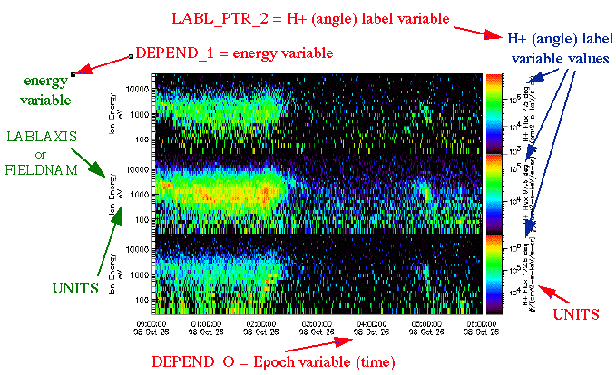

.. _cdf_guide:

##############################
Generating CDF Files
##############################

******************************
CDF Files Introduction
******************************
CDF files are binary files which require custom libraries to create and manipulate. Goddard Space Flight Center (GSFC) maintains these CDF libraries, and is the shepherd of the file format.

The GSFC describes CDF files as a "self-describing data format for the storage of scalar and multidimensional data in a platform- and discipline-independent way".

IMAP is archiving its science data with the `Space Physics Data Facility (SPDF) <https://spdf.gsfc.nasa.gov/>`_, which requires that data be in the CDF file format.

CDF Ecosystem
===============
**CDF** refers to more than just the files themselves, but the entire toolkit surrounding those files.  The official toolkits are available in IDL, C, Fortran and MATLAB.

For python implementations, there is **cdflib**, which is a pure-python implementation of the CDF libraries. **cdflib** doesn't require installing the C libraries, and also contains the functions "xarray_to_cdf" and "cdf_to_xarray" to convert between xarray Dataset objects in python and the CDF file formats.

The other main python library is **pycdf**, which is a part of **spacepy**.  Pycdf wraps the C libraries, and also includes various bells and whistles that help make the files a litle more python friendly.  However, because the L0-L2 processing will be making heavy use of "xarray", it will also be using "cdflib.xarray_to_cdf" to create the ".cdf" files.

What's in a CDF file?
======================

There are two parts of a CDF file that a user of the file ultimately cares about: Variables and Attributes.

The way these are astored in the file are somewhat complex, but that information is abstracted away from the end user.  The CDF libraries have functions to easily list and extract the variables and attributes within the CDF files.

The internal format of CDF files are described `here <https://cdaweb.gsfc.nasa.gov/pub/software/cdf/doc/cdf391/cdf39ifd.pdf>`_.

Variables
----------

.. image:: ../_static/cdf_variables.png

Variables are the data stored within a file.  They have a few key characteristics -

* Name
   * Variables are given a unique name
* Shape
   * The the number and the size of the dimensions.  In the picture above, "zVariable 1" is 5x5, and "zVariable 2" is 5x2.
* Data types
   * Describes what the data actually represents, some options include -
      * Integers (1-8 bytes)
      * Floats (1-8 bytes)
      * Characters (1 byte)
      * "Time" data
         *  For IMAP, the main time variable we'll be using is CDF_EPOCH_TT2000, which is nanoseconds since the year 2000.  More detail can be found in below sections.
* Records
   * Variables can span across multiple records.  This is essentially another dimension of the data, but the idea is that each record represents 1 unique physical measurement from an instrument.  In the above diagram, both variables have 3 records shown.

.. note:: For IMAP instruments, each "Record" is always a unit of time.  If a varible does not vary over time, it will only span 1 record.

Attributes
-----------

Attributes are essentially key:value pairs inside the CDF, similar to a python dictionary object.  For example - Mission=IMAP, or Instrument=IDEX.

Attributes come in two forms:

* **Variable Attributes** - Attributes can be attached to a Variable if they only describe a particular data variable.
* **Global Attributes** - If they are not attached to a variable, they describe the file in it's entirety.

ISTP Compliance
===============

ISTP compliance is a standard set of attributes to use when creating CDF files.  The goal of ISTP is that others users and programs of your CDF file will know where to look for information about the data inside.  A large part of these requirements are driven by the SPDF's display tool, `CDAWeb <https://cdaweb.gsfc.nasa.gov/cdaweb/>`_.

The image above is taken from CDAWeb. Several of the attributes inside the CDF file are used to help generate these plots.

To archive at the SPDF, files must be ISTP compliant.  The SPDF will reject files that do not conform to their standards.

A guide to SPDF can be found here: `https://spdf.gsfc.nasa.gov/istp_guide/istp_guide.html <https://spdf.gsfc.nasa.gov/istp_guide/istp_guide.html>`_

*****************************
cdflib.xarray_to_cdf
*****************************

The Python library `cdflib <https://github.com/MAVENSDC/cdflib>`_ is a pure-python implementation of the CDF libraries.  Of particular note is the function `xarray_to_cdf <https://cdflib.readthedocs.io/en/latest/api/cdflib.xarray.xarray_to_cdf.html#cdflib.xarray.xarray_to_cdf>`_.

**IMAP L0-L2 processing will be using this function to generate all CDF files**.

This function takes an `xarray.Dataset <https://docs.xarray.dev/en/stable/generated/xarray.Dataset.html>`_ object as input, and will output a CDF file.  Further details about how it works are below.

Xarray Introduction
===================

Xarray is a powerful python library for handling multi-dimensional data.  It has a strong connection with the netCDF file format.  The developers intended xaray to be an "in-memory" representation of a netCDF file.

Perhaps the largest difference between netCDF and CDF is that netCDF has built-in methods to attach *dimensions* and *coordinates* to data.  Similarly, xarray Datasets have this capability as well.
Full documentation about xarray Dataset objects are located here `https://docs.xarray.dev/en/stable/generated/xarray.Dataset.html <https://docs.xarray.dev/en/stable/generated/xarray.Dataset.html>`_

Within a CDF file, there is no inherent way to attach coordinates to a variable.  CDF is a simpler format, and only has the concept of Attributes and Variables.  The "CDF-native" way of specifying dimensions to a variable is to use "DEPEND" attributes (see sections :ref:`ISTP Compliance` and :ref:`DEPEND_i`).

.. note:: the netCDF file format was created by NOAA a few years after the CDF file format to plug in some of the shortfallings of the CDF file format.  These days, the orginal reasons for the split between the two formats have largely disappeared.

xarray_to_cdf
==============

The following is a minimal example of working with xarray_to_cdf -

.. code-block:: python

   from cdflib.xarray import xarray_to_cdf
   import xarray as xaray
   var_data = [[1, 2, 3], [4, 2, 6], [7, 8, 9]]
   var_dim = ['epoch', 'energy']
   epoch_data = [1, 2, 3]
   epoch = xr.Variable(epoch_dims, epoch_data)
   ds = xr.Dataset(data_vars={'data': data, 'epoch': epoch})
   xarray_to_cdf(ds, 'hello.cdf')

The xarray_to_cdf function converts an xarray.Dataset object into a CDF file.

For IMAP, we will be using the following flags on xarray_to_cdf

* datetime64_to_cdftt2000
   * Working with numpy datetime64 objects for time is recommended because of the precision afforded, as well as the speed of calculations
* istp
   * Enabled by default.  This flag will perform some checks to verify that the function is able to make ISTP compliant CDF files from the Dataset object.
* terminate_on_warning
   * This flag ensures that the function terminates if there are any issues found, so we can avoid creating incomplete or non-compliant files.

xarray_to_cdf with the above flags will perform the following steps -

Verification
-------------

#. Verifies that required global attributes are present to meet ISTP compliance
#. Verifies that variables have a VAR_TYPE attribute of either "data", "support_data", or "metadata"
#. Verifies that all variables have the appropriate number of DEPEND_{i} attributes, based on the number of dimensions of the variable
#. Verfies that the DEPEND_{i} attributes point to variables that are the size and shape expected to act as coordinates
#. Verifies that each variable has the expected variable attributes to be ISTP compliant

Conversion
-----------

#. Converts all variables with the word "epoch" in their name from datetime64 objects into the CDF native time format of CDF_TT2000 (nanoseconds since the year 2000)
#. Converts all other data into one of the following CDF native formats - CDF_INT8, CDF_DOUBLE, CDF_UINT4, or CDF_CHAR
#. Converts the attributes VALIDMIN, VALIDMAX, and FILLVAL to have the same data type as the data they are attached to
   * For example, if you specify the attribute VALIDMIN=5 for a variable named Epoch, it will be converted to a CDF_TT2000 data type when written to the file
#. Writes the Dataset attributes to the CDF file as the CDF's Global Attributes
#. Writes the Dataset's variables to the CDF file
   * Any variable with DEPEND_0 = Epoch as an attribute will be set to vary across records in the CDF file.  Otherwise, the data will be contained within a single record.
#. Writes the attributes attached to the Dataset Variables to the file

Shortcomings
-------------
While the above steps get a CDF file a large way towards ISTP compliance, there are several important caveats to take note of -

* This code does not check the values *within* the attributes (except VAR_TYPE and DEPEND_{i}), only that the attributes exist!
* This function does not put the "Epoch" variable as the first thing in the file, which was recommended (but not required) by the SPDF
* This code creates variables in a row-major format.  Column-major is recommended (but not required) by the SPDF.

******************************
Global Attributes
******************************

Global attributes are used to provide information about the data set as an entity. Together with variables and variable attributes, the global attributes make the data correctly and independently usable by someone not connected with the instrument team, and hence, a good archive product.

Global attributes that have been identified for use with IMAP data products are listed below. Additional Global attributes can be defined but they must start with a letter and can otherwise contain letters, numbers and the underscore character (no other special characters allowed). Note that CDF attributes are case-sensitive and must exactly follow what is shown here.

ISTP Compliant Global Attributes are listed here: `https://spdf.gsfc.nasa.gov/istp_guide/gattributes.html <https://spdf.gsfc.nasa.gov/istp_guide/gattributes.html>`_, and notes about how they are used on IMAP are below -

Data_type
==========
This attribute is used by CDF file writing software to create a filename. It is a combination of the following filename components: mode, data level, and optional data product descriptor.

Data_version
================
This attribute identifies the version of a particular CDF data file.

Descriptor
================
This attribute identifies the name of the instrument or sensor that collected the data.  Both a long name and a short name are given.  For any data file, only a single value is allowed.

For IMAP, the following are valid -

* IDEX>Interstellar Dust Experiment
* SWE>Solar Wind Electrons
* SWAPI>Solar wind and Pickup Ions
* CoDICE>Compact Dual Ion Compoition Experiment
* MAG>Magnetometer
* HIT>High-energy Ion Teleccope
* GLOWS>GLObal Solar Wind Structure
* IMAP-Hi>Interstellar Mapping and Acceleration Probe High
* IMAP-Lo>Interstellar Mapping and Acceleration Probe Low
* IMAP-Ultra>Interstellar Mapping and Acceleration Probe Ultra

Discipline
================
For IMAP, this value should always be “Space Physics>Heliospheric Physics.”. This attribute describes both the science discipline and sub discipline.

Generation_date
================
Date stamps the creation of the file using the syntax yyyymmdd, e.g. 20150923.

Instrument_type
================
This attribute is used to facilitate making choices of instrument type. More than one entry is allowed.  Valid IMAP values include:

* Electric Fields (space)
* Magnetic Fields (space)
* Particles (space)
* Plasma and Solar Wind
* Ephemeris

Logical_file_id
================
This attribute stores the name of the CDF file as described in Section 3.1 but without the file extension or version (e.g. ".cdf"). This attribute is required to avoid loss of the original source in the case of accidental (or intentional) renaming. This attribute must be manually set by the user during creation.

Logical_source
================
This attribute determines the file naming convention and is used by CDA Web.  It is composed of the following other attributes:

* Source_name - (e.g. "imap")
* Descriptor - (e.g. the instrument, see above)
* Data_type - (e.g. the mode, data level, and descriptor)

Logical_source_description
===========================
This attribute writes out the full words associated with the encrypted Logical_source above, e.g., "Level 1 Dual Electron Spectrometer Survey Data". Users on CDAWeb see this value on their website.

Mission_group
================
This attribute has a single value and is used to facilitate making choices of source through CDAWeb.  This value should be "IMAP".

PI_affiliation
================
This attribute value should include the IMAP mission PI affiliation followed by a comma separated list of any Co-I affiliations that are responsible for this particular dataset. The following are valid IMAP values, of which the abbreviations should be used exclusively within this attribute value, and the full text of the affiliation included in the general text attribute as it is used solely in plot labels.

* JHU/APL - Applied Physics Laboratory
* GSFC - Goddard Space Flight Center
* LANL - Los Alamos National Laboratory
* LASP - Laboratory for Atmospheric and Space Physics
* SWRI - Southwest Research Institute
* UCLA - University of California Los Angeles
* UNH - University of New Hampshire

PI_name
================
This attribute value should include first initial and last name of the IMAP mission PI followed by a comma-separated list of any Co-Is that are responsible for this particular dataset. For example, a single PI entry in this attribute would be: "Dr. David J. McComas".

Project
================
This attribute identifies the name of the project and indicates ownership. For IMAP, this value should be “STP>Solar-Terrestrial Physics”.

Source_name
================
This attribute identifies the observatory where the data originated. For IMAP, this should simply be "IMAP"

TEXT
================
This attribute is an SPDF standard global attribute, which is a text description of the experiment whose data is included in the CDF. A reference to a journal article(s) or to a World Wide Web page describing the experiment is essential, and constitutes the minimum requirement. A written description of the data set is also desirable. This attribute can have as many entries as necessary to contain the desired information. Typically, this attribute is about a paragraph in length and is not shown on CDAWeb.

MODS
================
This attribute is an SPDF standard global attribute, which is used to denote the history of modifications made to the CDF data set. The MODS attribute should contain a description of all significant changes to the data set, essentially capturing a log of highlevel release notes. This attribute can have as many entries as necessary and should be updated if the "X" value of the version number changes.

Parents
================
This attribute lists the parent data files for files of derived and merged data sets. The syntax for a CDF parent is: "CDF>logical_file_id". Multiple entry values are used for multiple parents. This attribute is required for any MMS data products that are derived from 2 or more data sources and the file names of parent data should be clearly identified. CDF parents may include source files with non-cdf extensions.

******************************
Variables
******************************
There are three types of variables that should be included in CDF files: data, support data, and metadata. Additionally, required attributes are listed with each variable type listed below.

To facilitate data exchange and software development, variable names should be consistent across the IMAP instruments. Additionally, it is preferable that data types are consistent throughout all IMAP data products (e.g. all real variables are CDF_REAL4, all integer variables are CDF_INT4, and flag/status variables are UINT4).
This is not to imply that only these data types are allowable within IMAP CDF files. All CDF supported data types are available for use by IMAP. For detailed information and examples, please see the following ISTP/IACG webpage:
`http://spdf.gsfc.nasa.gov/istp_guide/variables.html <http://spdf.gsfc.nasa.gov/istp_guide/variables.html>`_

Data
==============
These are variables of primary importance (e.g., density, magnetic field, particle flux). Data is always time (record) varying, but can be of any dimensionality or CDF supported data type. Real or Integer data are always defined as having one element.

Required Epoch Variable
------------------------
All IMAP CDF Data files must contain at least one cariable of data type CDF_TIME_TT2000 named "Epoch".  All time varying variables in the CDF data set will depend on either this "Epoch" or another variable of type CDF_TIME_TT2000.  More than one CDF_TIME_TT2000 variable is allowed in a data set to allow for more than one time resolution.  It is recommended that all such time variable use "Epoch" within their variable name.

.. note::
   In the xarray_to_cdf function described above, all variables with "epoch" in their name will be converted to CDF_TT2000 if the flag "istp=True" is given.

For ISTP compliance, the time value of a record refers to the **center** of the accumulation period if the measurement is not an instantaneous one.

CDF_TT2000 is defined as an 8-byte signed integer with the following characteristics:

* Time_Base=J2000 (Julian date 2451545.0 TT or 2000 January 1, 12h TT)
* Resolution=nanoseconds
* Time_Scale=Terrestrial Time (TT)
* Units=nanoseconds
* Reference_Position=rotating Earth Geoid

Given a current list of leap seconds, conversion between TT and UTC is straightforward (TT = TAI + 32.184s; TT = UTC + deltaAT + 32.184s, where deltaAT is the sum of the leap seconds since 1960; for example, for 2009, deltaAT = 34s). Pad values of -9223372036854775808 (0x8000000000000000) which corresponds to 1707-09-22T12:13:15.145224192; recommended FILLVAL is same.

It is proposed that the required data variables VALIDMIN and VALIDMAX are given values corresponding to the dates 1990-01-01T00:00:00 and 2100-01-01T00:00:00 as these are well outside any expected valid times.

Required Attributes
---------------------

CATDESC
^^^^^^^^^^^^^^^^
This is a human readable description of the data variable. Generally, this is an 80-character string which describes the variable and what it depends on.

DEPEND_0
^^^^^^^^^^^^^^^^
Explicitly ties a data variable to the time variable on which it depends. All variables which change with time must have a DEPEND_0 attribute defined.

DEPEND_i
^^^^^^^^^^^^^^^^
Ties a dimensional data variable to a SUPPORT_DATA variable on which the i-th dimension of the data variable depends. The number of DEPEND attributes must match the dimensionality of the variable, i.e., a one-dimensional variable must have a DEPEND_1, a two-dimensional variable must have a DEPEND_1 and a DEPEND_2 attribute, etc. The value of the attribute must be a variable in the same CDF data set. It is strongly recommended that DEPEND_i variables hold values in physical units. DEPEND_i variables also require their own attributes, as described in the following sections.

DISPLAY_TYPE
^^^^^^^^^^^^^^^^
This tells automated software, such as CDAWEB, how the data should be displayed.
Examples of valid values include

* time_series
* spectrogram
* stack_plot
* image

FIELDNAM
^^^^^^^^^^^^^^^^
A shortened version of CATDESC which can be used to label a plot axis or as a data listing heading. This is a string, up to ~30 characters in length.

FILLVAL
^^^^^^^^^^^^^^^^
Identifies the fill value used where data values are known to be bad or missing.
FILLVAL is required for time-varying variables. Fill data are always non-valid data. The
ISTP standard fill values are listed below

* BYTE ---- -128
* INTEGER*2 ---- -32768
* INTEGER*4 ---- -2147483648
* INTEGER*8 ---- -9223372036854775808
* Unsigned INTEGER*1 ---- 255
* Unsigned INTEGER*2 ---- 65535
* Unsigned INTEGER*4 ---- 4294967295
* REAL*4 ---- -1.0E31
* REAL*8 ---- -1.0E31
* EPOCH ---- -1.0E31 (9999-12-31:23:59:59.999)
* EPOCH16 ---- -1.0E31 (9999-12-31:23:59:59.999999999999)
* TT2000 ---- -9223372036854775808LL (9999-12-31:23:59:59.999999999999)

.. note::
   Using xarray_to_cdf, these values are automatically cast to be the same type of data as the CDF variable they are attached to.  For example, if your data is REAL4 and you specify your VALIDMIN=0, the function will know to store the "0" as a REAL4 type as well.

FORMAT
^^^^^^^^^^^^^^^^
This field allows software to properly format the associated data when displayed on a screen or output to a file. Format can be specified using either Fortran or C format codes. For instance, "F10.3" indicates that the data should be displayed across 10 characters where 3 of those characters are to the right of the decimal.

LABLAXIS
^^^^^^^^^^^^^^^^
Used to label a plot axis or to provide a heading for a data listing. This field is generally 6-10 characters.

UNITS
^^^^^^^^^^^^^^^^
A 6-20 character string that identifies the units of the variable (e.g. nT for magnetic field). Use a blank character, rather than "None" or "unitless", for variables that have no units (e.g., a ratio or a direction cosine).

VALIDMIN
^^^^^^^^^^^^^^^^
The minimum value for a particular variable that is expected over the lifetime of the mission. Used by application software to filter out values that are out of range. The value must match the data type of the variable.

.. note::
   Using xarray_to_cdf, these values are automatically cast to be the same type of data as the CDF variable they are attached to

VALIDMAX
^^^^^^^^^^^^^^^^
The maximum value for a particular variable that is expected over the lifetime of the mission. Used by application software to filter out values that are out of range. The value must match the data type of the variable.

.. note::
   Using xarray_to_cdf, these values are automatically cast to be the same type of data as the CDF variable they are attached to

VAR_TYPE
^^^^^^^^^^^^^^^^
Used in CDAWeb to indicate if the data should be used directly by users. Possible values:
* "data" - integer or real numbers that are plottable
* "support_data" - integer or real "attached" or secondary data variables
* "metadata" - labels or character variables
* "ignore_data" - placeholders

Support Data
==============
These are variables of secondary importance employed as DEPEND_i variables as
described in section 5.1.3.3 (e.g., time, energy_bands associated with particle flux), but
they may also be used for housekeeping or other information not normally used for
scientific analysis.

DELTA_PLUS_VAR and DELTA_MINUS_VAR
-------------------------------------

DEPEND_i variables are typically physical values along the corresponding i-th dimension of the parent data variable, such as energy levels or spectral frequencies. The discreet set of values are located with respect to the sampling bin by DELTA_PLUS_VAR and DELTA_MINUS_VAR, which hold the variable name containing the distance from the value to the bin edge. It is strongly recommended that IMAP DEPEND_i variables include DELTA_PLUS_VAR and DELTA_MINUS_VAR attributes that point to the appropriate variable(s) located elsewhere in the CDF file.

For example, for a variable energy_level that is the DEPEND_i of a particle distribution, if energy_dplus and energy_dminus are two variables pointed to by energy_level’s DELTA_PLUS_VAR and DELTA_MINUS_VAR, then element [n] corresponds to the energy bin (energy_level[n]-energy_dminus[n]) to (energy_level[n]+energy_dplus[n]). DELTA_PLUS_VAR and DELTA_MINUS_VAR can point to the same variable which implies that energy_level[n] is in the center of the bin. DELTA_PLUS_VAR and DELTA_MINUS_VAR must have the same number of values as the size of the corresponding dimension of the parent variable, or hold a single constant value which applies for all bins. They can be record-varying, in which case they require a DEPEND_0 attribute.

In the case of the DEPEND_0 timetag variable, DELTA_PLUS_VAR and DELTA_MINUS_VAR together with the timetag identify the time interval over which the data was sampled, integrated, or otherwise regarded as representative of. DELTA_PLUS_VAR and DELTA_MINUS_VAR variables require FIELDNAM, UNITS and SI_CONVERSION attributes; in principle, these could differ from those of the DEPEND_i parent. They also require VAR_TYPE=SUPPORT_DATA. Other standard attributes might be helpful.

Required Attributes
--------------------
Variables appearing in a data variable's DEPEND_i attribute require a minimal set of their own attributes to fulfill their role in supporting the data variable.

* CATDESC
* DEPEND_0 (if time varying)
* FIELDNAM
* FILLVAL (if time varying)
* FORMAT/FORM_PTR
* SI_CONVERSION
* UNITS/UNIT_PTR
* VALIDMIN (if time varying)
* VALIDMAX (if time varying)
* VAR_TYPE = “support_data”

These attributes are otherwise the same as described in the above section for data variables

******************************
Variable Naming Convention
******************************

Data
=============
IMAP data variables must adhere to the following naming conventions:

instrument_parameter[_coordinateSystem][_parameterQualifier][_subModeLevel][_Mode][_DataLevel]

An underscore is used to separate different fields in the variable name.  It is strongly recommended that variable named employ further fields, qualifiers, and information designed to identify unambiguously the nature of the variable, instrument mode, and data processing level, with sufficient detail to lead the user to the unique source file which containers the variable.  It is recommended to follow the order shown below

These variable names may only include lower-case letters, numbers, underscores, and hyphens.  No upper-case letter or other special characters are allowed.

Required
---------
* instrument - the instrument acronym
* parameter - a short representation of the physical parameter held in the variable

Optional
---------
* coordinateSystem - an acronym for the coordinate system in which the parameter is set
* parameterQualifier - parameter descriptor, which may include multiple components separated by a "_" as needed (e.g. "pa_0" indicates a pitch angle of 0)
* subModeLevel - Qualifiers to include mode and data level information supplementary to the next to fields
* mode - The mode of the instrument
* dataLevel - The data level in the "Data_type" attribute field

Support Data
================
Support data variable names must begin with a letter and can contain numbers and underscores, but no other special characters. Support data variable names need not follow the same naming convention as Data Variables (5.1.1) but may be shortened for convenience.

******************************
File Naming Convention
******************************
CDF data files have names of the following form:

mission_instrumentId_dataLevel[_mode][_descriptor]_startTime_vXX-YY.cdf

where...

* mission
   * imap
* instrumentId
   * idex
   * swe
   * swapi
   * imap-lo
   * imap-hi
   * imap-ultra
   * hit
   * glows
   * codice
   * swe
   * mag
* dataLevel
   * "l1a", "l1b", "l2", "ql", "l2pre" "l3", etc
* mode (optional)
   * "fast", "slow", "brst", "srvy"
* descriptor (optional)
   * identifiers should be short (e.g. 3-8 character) descriptors that are helpful to end-users. If a descriptor contains multiple components, hyphens are used to separate those components. For instance, an optional time span may be specified as "-2s" to represent a data file that spans two seconds. In this case, "10s" and "-5m" are other expected values that correspond with ten seconds and 5 minutes respectively.
* startTime
   * YYYYMMDD format
   * This is the date that the data in the file *starts*.  Files are almost always 24 hours in duration.
* vXX-YY
   * A 2-part version number as described below.
   * Increments of XX represents a significant change to the processing software and/or the CDF file structure.  Users should consult the appropriate metadata or changelogs to determine what has changed before working with newer versions of the data.
   * Increments of YY represent reprocessing because of new/updated inputs, or updated calibration.  New files on the SDC will automatically be given a new version if their checksum is different from the previous

.. note::
   It is expected that the file name can be generated from the contents of the file. The "Logical_source" global attribute should contain the mission, instrumentId, dataLevel and mode (if applicable.)  Start_time is the date of the first data point (record) in the file, and the version is the Data_version global attribute.

******************************
SKTeditor
******************************

After CDF files are generated, it is helpful to check for any compliance errors using the `SKTeditor <https://spdf.gsfc.nasa.gov/skteditor/>`_ tool.

You can download this tool from the link above, and open the created file there.  You can click "Show Messages" in the lower right-hand corner, and it will provide details about any ISTP compliance errors that the code may have missed.

******************************
SPDF Validation
******************************

As a final validation step, the SPDF will review all completed data produts.  They will run the CDF file through the SKTeditor as a first pass, and also ensure that the auto-generated plots look nice on CDAWeb using the IDL tool `https://cdaweb.gsfc.nasa.gov/cdfx/ <https://cdaweb.gsfc.nasa.gov/cdfx/>`_.

They will also perform a final check on all of the attribute values to ensure they make sense from a user perspective. Some examples of errors caught so far include:

* The "TEXT" global attribute needs to be longer
* VALIDMIN and VALIDMAX need to be reasonable numbers
* FIELDNAM and CATDESC need to be more descriptive
* Logical_source_description needs to be more formal, like "Low gain channel of the time-of-flight signal" instead of "This is the variable for...."
* "Metadata" fields from the CCSDS packet should be made into "VAR_YPE=data" rather than "support_data" or "metadata"
   * support_data is reserved for coordinate data, i.e. the variable that other "DEPEND_{i}" attributes point to
   * metadata is reserved for text-based variable, like pointers to text labels

******************************
Summary and Final Example
******************************

In summary, the IMAP mission will be using the python ``cdflib.xarray_to_cdf`` tool to create ISTP-compliant CDF files.  Certain attributes are required to exist in the file, which can be filled in as xarray attributes / python dictionary objects.

As an example, suppose there is an instrument on IMAP named JIM that took 3 samples of ions at 3 different energies, such that the data looks like the following -

+------------------------+------------+------------+------------+
| Time \                 | 0.5-1.5 eV | 1.5-2.5 eV | 2.5-3.5 eV |
| Energy Bins            |            |            |            |
+========================+============+============+============+
| 2025-01-01T00:00:01    | 1          | 2          | 3          |
+------------------------+------------+------------+------------+
| 2025-01-01T00:00:02    | 4          | 5          | 6          |
+------------------------+------------+------------+------------+
| 2025-01-01T00:00:03    | 7          | 8          | 9          |
+------------------------+------------+------------+------------+

The following python code is the **minimum** code you'd need to store this data in a CDF file that is fully compliant with the above documentation -

.. code-block:: python

   from cdflib.xarray import xarray_to_cdf
   import numpy as np
   import xarray as xr

   INT_FILLVAL = np.iinfo(np.int64).min # Recommended FILLVAL for all integers
   DOUBLE_FILLVAL = np.float64(-1.0e31) # Recommended FILLVALL for all floats
   MIN_EPOCH = -315575942816000000 # Recommended min/max Epoch
   MAX_EPOCH = 946728069183000000 # Recommended min/max Epoch

   global_attrs = {
      # Project, Source_name, Descipline, Mission Group, and PI info will all
      # stay the same for all instruments on IMAP.
      "Project": "STP>Solar-Terrestrial Physics",
      "Source_name": "IMAP>Interstellar Mapping and Acceleration Probe",
      "Discipline": "Solar Physics>Heliospheric Physics",
      "Mission_group": "IMAP>Interstellar Mapping and Acceleration Probe",
      "PI_name": "Dr. David J. McComas",
      "PI_affiliation": [
         "Princeton Plasma Physics Laboratory",
         "100 Stellarator Road, Princeton, NJ 08540",
      ],
      # The following attributes are specific to JIM.
      "Instrument_type": "Particles (space)",
      "Data_type": "L1_Mode_Description>Level-1 Mode Description",
      "Data_version": "01",
      "Descriptor": "JIM>Just an Ion Monitor",
      "TEXT": (
         "JIM is a fictitious instrument that counts ions at 3 different energies on "
         "the IMAP mission. This is where a detailed description of the instrument "
         "goes, as well as the type of data in the file.  For example, if a (mode) "
         "or (descriptor) exist they can be described here."
      ),
      "Logical_file_id": "imap_jim_l1_mode_description_20250101_v01",
      "Logical_source": "imap_jim_l1_mode_description",
      "Logical_source_description": "IMAP Mission JIM Instrument Level-1 (mode) (description) Data.",
   }

   # These epoch attributes will remain the same across all instruments
   epoch_attrs = {
      "CATDESC": "Default time",
      "FIELDNAM": "Epoch",
      "FILLVAL": INT_FILLVAL,
      "FORMAT": "a2",
      "LABLAXIS": "Epoch",
      "UNITS": "ns",
      "VALIDMIN": MIN_EPOCH,
      "VALIDMAX": MAX_EPOCH,
      "VAR_TYPE": "support_data",
      "SCALETYP": "linear",
      "MONOTON": "INCREASE",
      "TIME_BASE": "J2000",
      "TIME_SCALE": "Terrestrial Time",
      "REFERENCE_POSITION": "Rotating Earth Geoid",
   }

   # Describes a variable that holds the energy bins for the real data
   energy_bins_attrs = {
      "CATDESC": "The energy bins for the JIM instrument",
      "FIELDNAM": "Energy bins",
      "FILLVAL": np.float64(-1.0e31),
      "FORMAT": "I12", # Display up to 12 numbers of an integer
      "LABLAXIS": "Energy",
      "UNITS": "eV",
      "VALIDMIN": 1, #Fabricated value
      "VALIDMAX": 3, #Fabricated value
      "VAR_TYPE": "support_data",
      "SCALETYP": "linear",
      "VAR_NOTES": (
         "We pretend there are 3 energy bins that data is collected for. "
         "The 3 Energy bins are 0.5-1.5, 1.5-2.5, and 2.5-3.5 electron Volts. "
         "These are used by the variable imap_jim_counts_(mode)_(description)"
         "Ideally we would actually have additional variables that describe "
         "the minimum and the maximum values in each of these bins, but for our "
         "purposes of creating a minimal example, we'll leave extra varaibles out. "
         "Longer notes about the variable can be placed into this attribute."
      ),
   }

   # Describes a variable that holds the "counts" data
   counts_attrs = {
      "DEPEND_0": "Epoch",
      "DEPEND_1": "Energy",
      "DISPLAY_TYPE": "spectrogram",
      "FILLVAL": INT_FILLVAL,
      "FORMAT": "I12", # Display up to 12 numbers of an integer
      "UNITS": "counts",
      "VALIDMIN": 0, # Fabricated value
      "VALIDMAX": 5000, # Fabricated value
      "VAR_TYPE": "data",
      "SCALETYP": "linear",
      "VARIABLE_PURPOSE": "PRIMARY",
      "CATDESC": "80 character description of the measurement goes here. For JIM, we mention it is counts per energy bin per time. ",
      "FIELDNAM": "Counts per Energy Bin",
      "LABLAXIS": "Ion Counts",
      "VAR_NOTES": (
         "The number of ions counted at each energy bin. "
         "Sampled at 1 sample per second, at 1, 2, and 3 eV. "
      ),

   }

   # Create 3 data arrays, one for time, one for the energies, and one for the real data
   epoch_xr = xr.DataArray(
                  name="Epoch",
                  data=[np.datetime64("2025-01-01T00:00:01"), np.datetime64("2025-01-01T00:00:02"), np.datetime64("2025-01-01T00:00:03")],
                  dims=("Epoch"),
                  attrs=epoch_attrs,
               )
   energy_xr = xr.DataArray(
                  name="Energy",
                  data=[1,2,3], # Fabricated energy bins
                  dims=("Energy_dim"),
                  attrs=energy_bins_attrs,
               )
   counts_xr = xr.DataArray(
               name="imap_jim_counts_(mode)_(descriptor)",
               data=[[1,2,3], [4,5,6], [7,8,9]], # Fabricated data
               dims=("Epoch", "Energy_dim"),
               attrs=counts_attrs,
         )
   # Combine the data into an xarray.Dataset object
   data = xr.Dataset(data_vars={
                           "imap_jim_counts_mode_descriptor": counts_xr,
                     },
                     coords={
                           "Epoch": epoch_xr,
                           "Energy": energy_xr
                     },
                     attrs=global_attrs
                  )
   # Convert the data into a CDF using cdflib
   xarray_to_cdf(
         data,
         "imap_jim_l1_mode_description_20250101_v01.cdf",
         datetime64_to_cdftt2000=True,
         terminate_on_warning=True,
      )