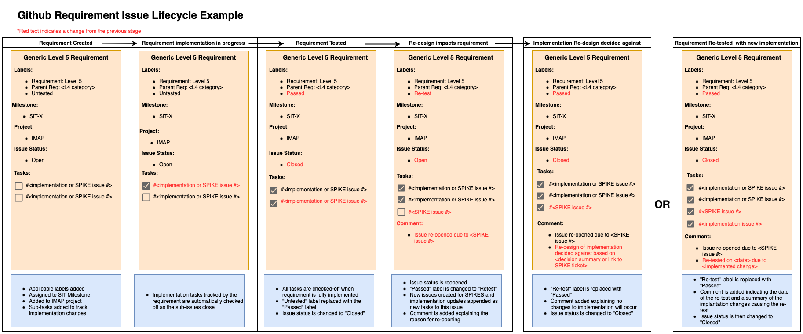

.. _requirement-and-issue-tracking:

Requirement and Issue Tracking
------------------------------

Definitions
^^^^^^^^^^^
=================== ===================================================================================================================================================================================================================================================
Name                Definition
=================== ===================================================================================================================================================================================================================================================
Level 4 requirement requirements that have been decomposed to the SDC level. Level 4 requirements have already been defined.
Level 5 requirement requirements decomposed from the level 4 requirements that better define how the SDC plans to satisfy the parent level 4 requirement, while not defining any implementation details. Example: Backup *Metadata* to AWS backup account vs. Backup *OpenSearch* to AWS backup account
Implementation task Github issue that better defines how a certain feature will be implemented. Implementation tasks are tracked under the parent level 5 requirement as a sub-task. Each implementation task should be small enough to be handled in a single PR.
SPIKE               Github issue created to investigate different architecture design approaches. Like implementation tasks, SPIKEs should be tracked under the applicable level 5 requirement as a sub-task.
=================== ===================================================================================================================================================================================================================================================

Requirements Overview
^^^^^^^^^^^^^^^^^^^^^

Requriements Mapping
~~~~~~~~~~~~~~~~~~~~

* Each level 4 requirement is mapped to at least one SIT.
* Each level 4 requirement relevant to the upcoming SIT is decomposed into level 5 requirements that, together, cover the testing requirements of the SIT.
* The level 5 requirement creation is incremental as we move through development for each SIT.
* Each Level 5 requirement will have implementation tasks (sub-issues) that fully cover the Level 5 requirement and contain implementation specific information.

Requirements Lifecycle
~~~~~~~~~~~~~~~~~~~~~~
The below image shows an example of the lifecycle of a Level 4 requirement over the course of the project:

Overview of Managing Requirements in Github
^^^^^^^^^^^^^^^^^^^^^^^^^^^^^^^^^^^^^^^^^^^

* All level 5 requirements will be managed as Github issues.
* The status of the requirement issue ("Open" / "Closed") is an indication of both development and testing status, so a requirement is not "Closed" until it is implemented and has passed a SIT.
* Requirement issues should track sub-issues that describe the implementation.
   * Unlike the L5 requirement issues, these issues close once the code is merged.
   * Sub-issues allow for better tracking of how SPIKES, implementation issues, and requirements are related to each other.  They also allow the use of L5 requirements as a starting point to see the design history of each feature.
* If a re-design is proposed that impacts an already tested requirement, that requirement issue should be re-opened and any new SPIKEs or implementation tasks should be appended to the original task list.
   * Doing this will keep a record of the evolution of implementation decisions that impacted the requirement and a record of the requirement status throughout the project.
   * This is useful for providing context to new team members or anyone who needs to remember why a particular design was chosen to satisfy a requirement vs another approach.
* A backlog grooming will take place once per month to re-prioritize and clean up the issue board.

Level 5 Requirements in Github
^^^^^^^^^^^^^^^^^^^^^^^^^^^^^^

Creating level 5 requirements
~~~~~~~~~~~~~~~~~~~~~~~~~~~~~
* Level 5 requirements should be created using the "L5 Requirement" issue template.
   * As part of this template, the L5 summary, Parent (Level 4) Requirement, and list of tasks (sub-issues) are filled in.
   * If you don't have sub-issues created to link in the task list, you can add text as a reminder or add them later. 
   * The task list should only be appended to for the lifetime of the project.
* Upon creation a requirement should be given the following the tags:
   * "Requirement: Level 5" (you get this for free by selecting the "L5 Requirement" issue template)
   * The appropriate parent requirement category label (Ex. Parent Req: SDC Data Transfer Monitoring)
   * "Untested" (This describes the testing status of the requirement)
* Each requirement should be added to the IMAP project board.
* Each requirement should be assigned a SIT milestone.

Example:

Github Requirement Issue Lifecycle
~~~~~~~~~~~~~~~~~~~~~~~~~~~~~~~~~~
The following diagram gives an example of the general information a level 5 requirement issue should contain as it evolves over the lifecycle of development and testing:

Adding and Tracking sub-issues
~~~~~~~~~~~~~~~~~~~~~~~~~~~~~~

Each level 5 requirement will track all of the SPIKE and implementation issues associated with the feature. The sub-issues will show up as check boxes that will automatically be checked off when the sub-issue is closed. 

The task list can be created as follows:

In the tasks section of the L5 requirement issue the task checkbox is created using :code:`- [ ]`, then typing the :code:`#` character will bring up a selection window with different issue numbers. The selection options will narrow down as you add numbers. Type the issue number you want to link or select the issue from the selection window. If you click the preview tab, you can see the sub-issue is properly linked.

.. image:: ../../_static/sub-issue-preview.png
   :alt: Requirement decomposition diagram
   :width: 434
   :height: 250

Implementation issues in Github
^^^^^^^^^^^^^^^^^^^^^^^^^^^^^^^

Creating implementation issues in Github
~~~~~~~~~~~~~~~~~~~~~~~~~~~~~~~~~~~~~~~~
* Implementation issues should be created using the Feature template issue template.
* Implementation issues should be tracked in the corresponding level 5 requirement issue.
* These issues should be tied to PRs.

SPIKE issues in Github
^^^^^^^^^^^^^^^^^^^^^^
* SPIKE issues should be created using the SPIKE issue template
* SPIKE issues are created to investigate architecture/implementation approaches in preparation for a team discussion.
* Following SPIKE issue resolution, at least one implementation issue should be created for developement of the agreed solution.