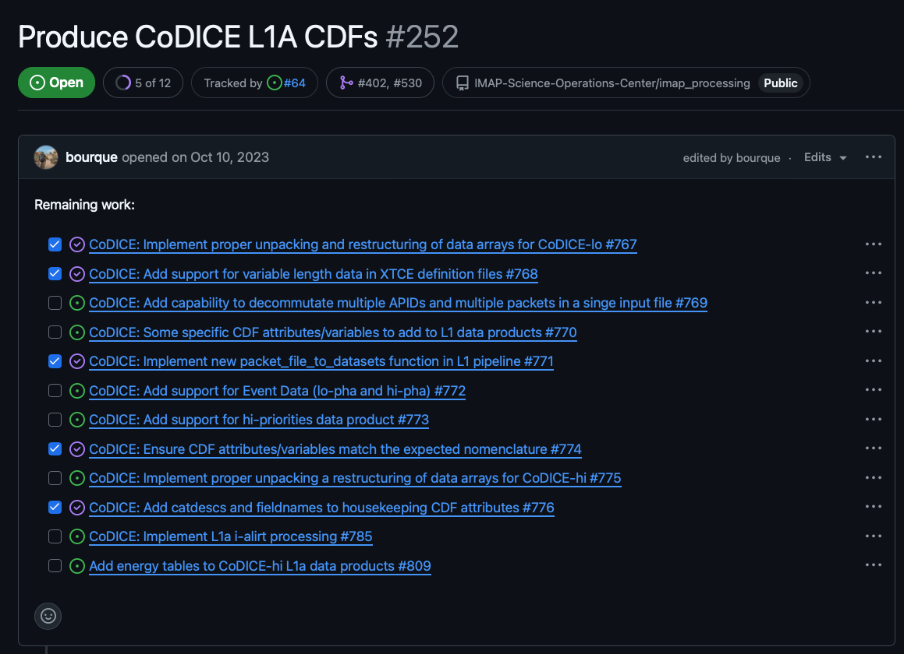

.. _work-management:

Work Management
===============

Work Management Overview
------------------------

The SDC uses Github issues to track work. These issues are organized into two types of tasks: high-level tasks and implementation tasks.

- High-level tasks
    - used to track the progress of each instrument and data level
    - used to track progress on infrastructure tasks (ie. Reprocessing high-level task)
    - tasks should be fairly static throughout development and will only change if an instrument changes their data products or levels
    - used to track the progress of implementation tasks
    - managed in the high-level board
    - labeled with the "Repo: Parent Issue" GitHub label
- Implementation tasks
    - define work that needs to be implemented
    - each task should be small enough to be handled in a single PR
    - organized as sub-tasks under high-level tasks
    - should be added to high-level tasks as soon as they are identified
    - should have work estimates tied to each task
    - managed in the release boards

The below image shows an example of a high-level task with sub-tasks for implementation tasks:

Project Boards
--------------

The SDC utilizes two types of project boards for tracking work:

- High-level board
    - only tracks high-level tasks
    - provides a quick view of the progress being made across instruments
- Release board
   - only tracks implementation tasks
   - uses a two month rolling window for planning implementation tasks for the next two releases

High-level Board
~~~~~~~~~~~~~~~~

The `high-level board <https://github.com/orgs/IMAP-Science-Operations-Center/projects/2/views/32>`_ contains a task for each instrument and data level. The tasks showing in this board should be fairly static throughout development and would only change if a instrument changes their data products or levels. This board provides a quick view of the progress being made across instruments.

Release Board
~~~~~~~~~~~~~

The `release board <https://github.com/orgs/IMAP-Science-Operations-Center/projects/2/views/30>`_ allows for more detailed planning for the the current and upcoming release.
Any tasks in the current release board that are not completed by the end of the release will be pushed to the next release.
If all tasks are completed for an instrument in the current release, tasks from the next release can be pulled in to the current release board.

Backlog Grooming
----------------

The SDC holds a monthly backlog grooming prior to the start of each release. The purpose of the backlog grooming is to plan the work for the upcoming release and make our best attempt to create an executable plan for the release.
The backlog grooming is also used to notify the team of any changes in tasks or work estimates that have not already been accounted for in the SIT planning.
Any changes in time allocation should also be reported.
These changes will be added to the SIT planning document to keep the projected timeline up to date.

Before Backlog Grooming
~~~~~~~~~~~~~~~~~~~~~~~

Prior to the backlog grooming, developers look through implementation tasks under their high-level tasks. The implementation tasks each developer identifies for the next release should be added to the board.
The developers also tag each implementation task with an estimated time to complete the task and check that the sum of the work estimates are within the developer's capacity for the release.

During Backlog Grooming
~~~~~~~~~~~~~~~~~~~~~~~
During the backlog grooming, the team reviews tasks in the release board, makes sure tasks are well defined, and everyone gets a team-wide view of the work that needs to be done.
This includes checking for any gaps or dependencies that need to be addressed prior to the start of the release.

The capacity of the team will also be reviewed to make sure that release plan is realistic.
Capacity is determined by taking the number of hours a developer is allocating to the mission/instrument and multiplying that by 80% to account for meetings, PR reviews, and other non-development tasks.
This capacity is then compared to the sum of the work estimates of the tasks assigned to the developer on the release board.

After Backlog Grooming
~~~~~~~~~~~~~~~~~~~~~~~
During the development of a release, developers will add sub-tasks from their high-level tasks on to release board for the next month to begin planning for the next release.
